# Demo Gallery

**语言选择：**中文 | [English](README.md)

这里展示的是 AI Cinematic Prompt 的示例图，覆盖几类常见电影级画面方向：霓虹人物、巨构世界、史诗龙场景和太空悬疑。

## 霓虹人物

| 自动售货机特写 | 洗衣店窗边 | 雨伞人像 | 便利店橱窗 |
|---|---|---|---|
| 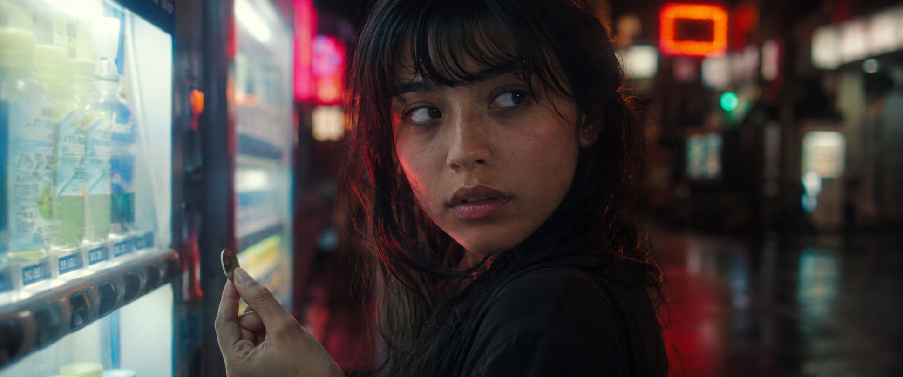 | 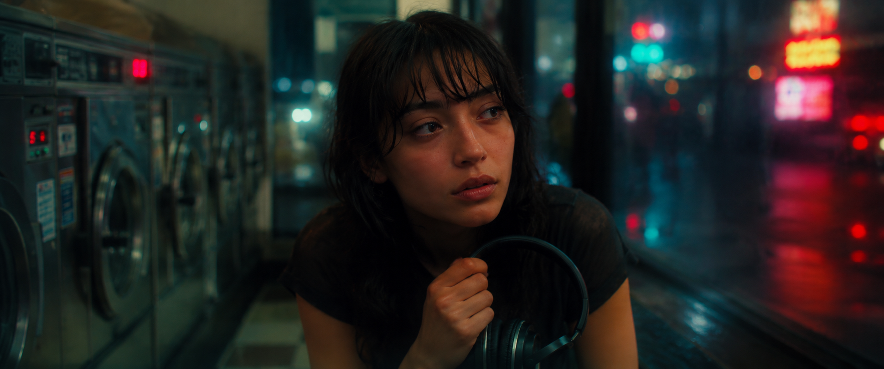 | 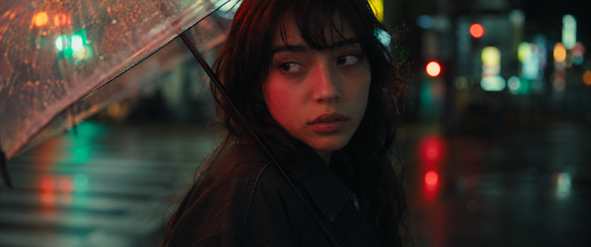 | 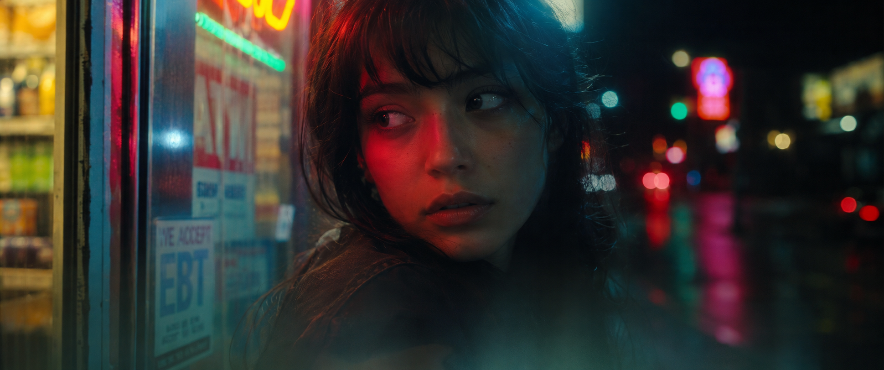 |

## 巨构世界

| 月面尖塔朝圣 | 海洋巨兽城堡 | 风暴谷巨构 |
|---|---|---|
| 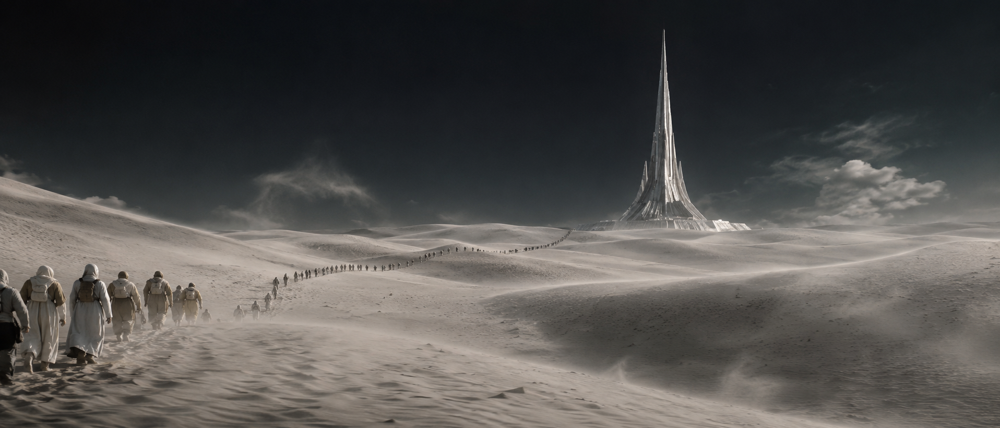 | 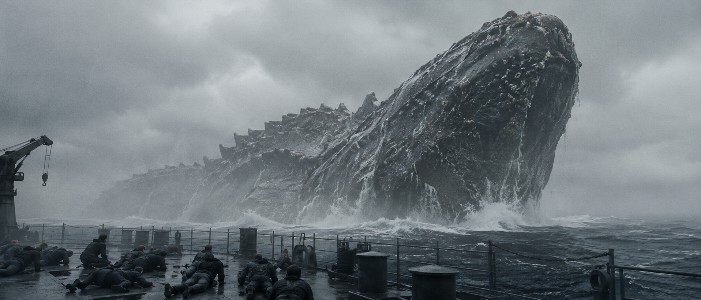 | 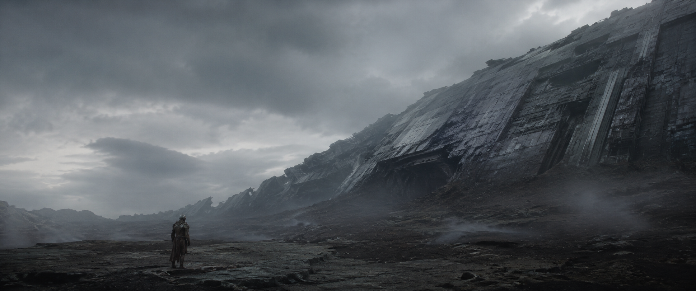 |

## 史诗龙场景

| 装甲旅人面对巨龙 | 迷雾中发光眼巨龙 | 龙翼山谷俯瞰 |
|---|---|---|
| 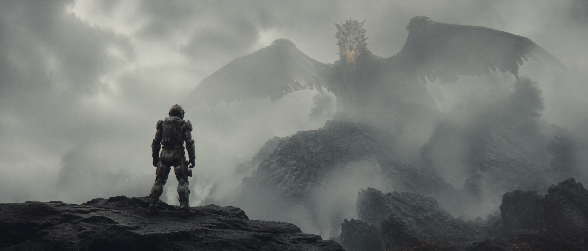 | 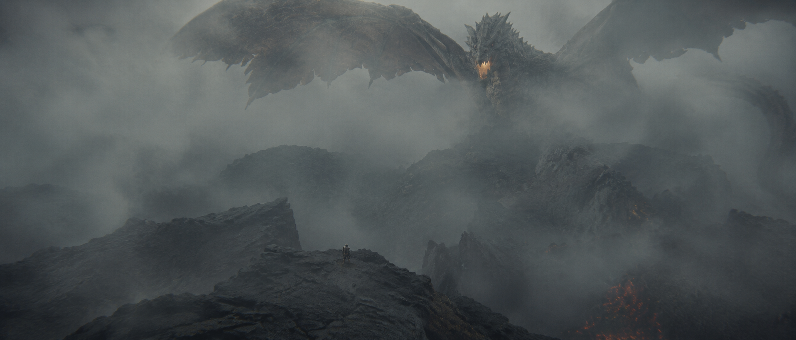 | 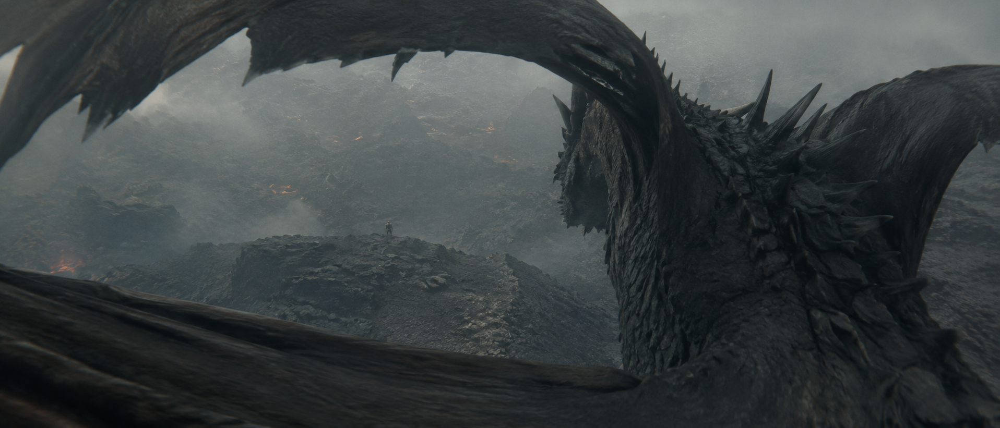 |

## 太空悬疑

| 地球下方漂浮舱 | 舰桥船员望向地球 | 结霜头盔特写 | 头盔玻璃求救字 |
|---|---|---|---|
| 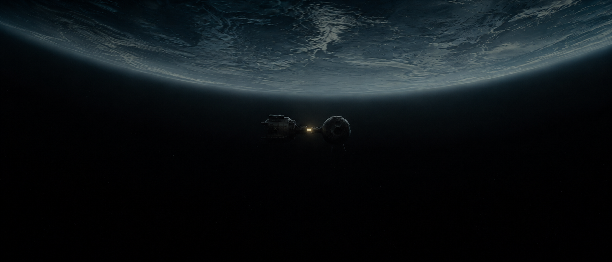 | 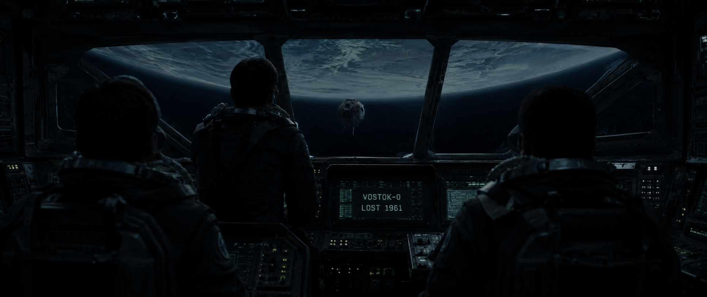 | 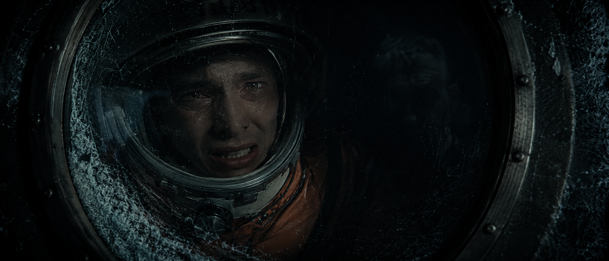 | 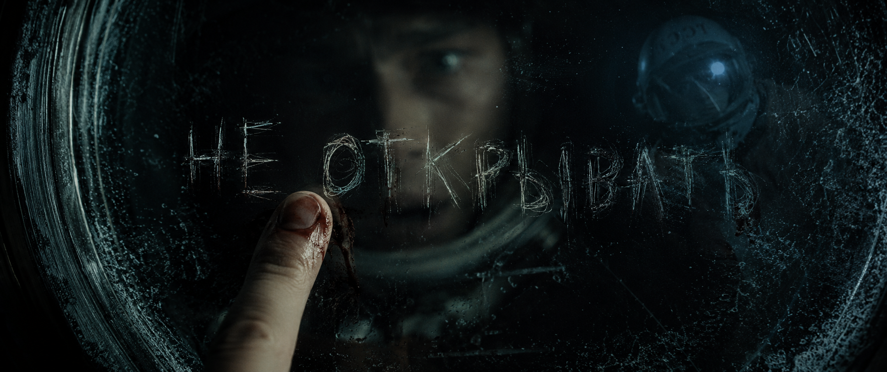 |

## 示例 Prompt

```text
用 euphoria 的霓虹高对比 LOOK，生成一个雨夜便利店外的孤独人物特写。
```

```text
用 dune_arrakis 的科幻史诗 LOOK，生成一支朝圣队伍穿过月面沙丘走向银色尖塔。
```

```text
用 hbo_grey_epic 的灰调史诗 LOOK，生成一名装甲旅人站在火山峡谷边面对巨龙。
```

```text
用 dark_knight 的低调写实 LOOK，生成一个宇航员透过结霜舷窗看到失踪太空舱。
```
